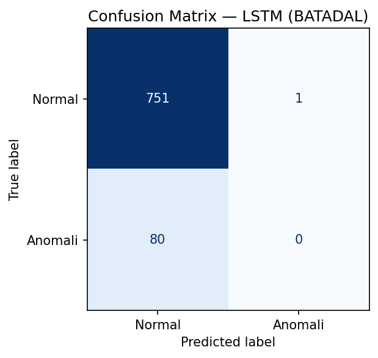
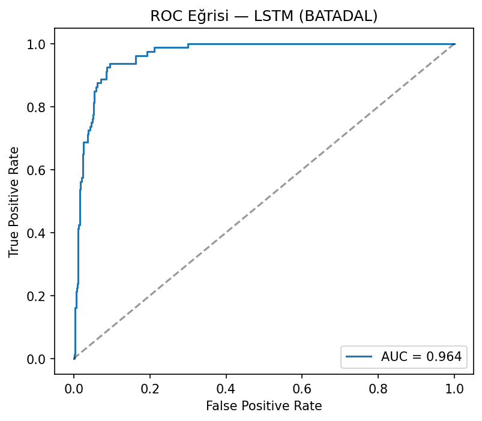
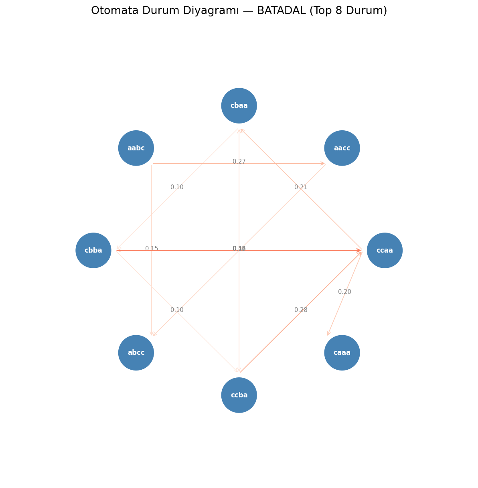
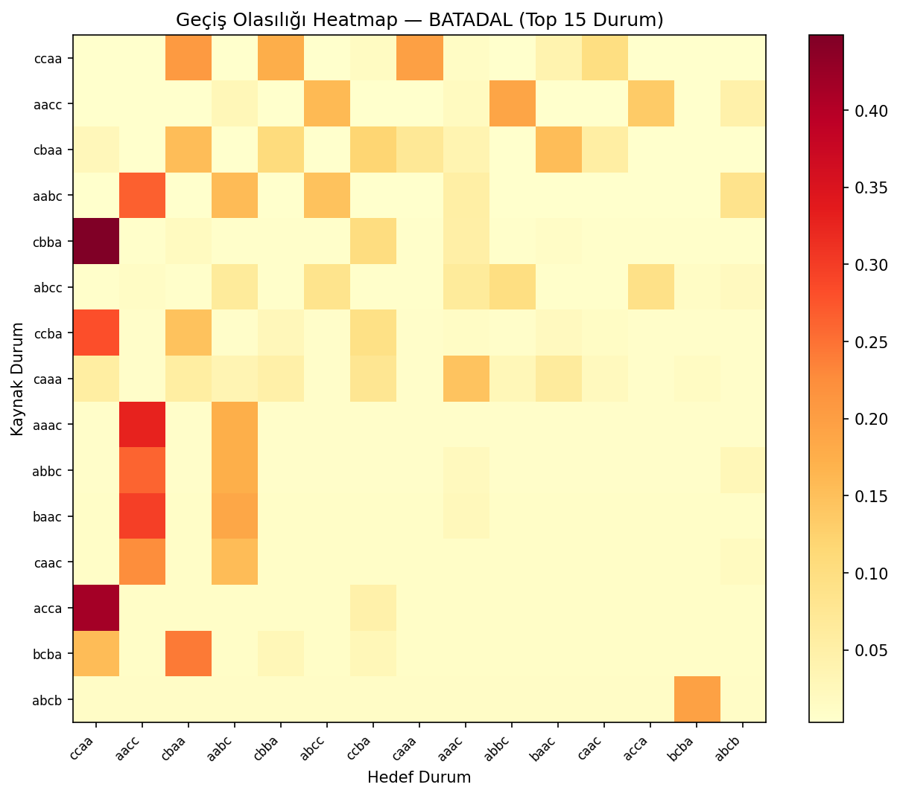
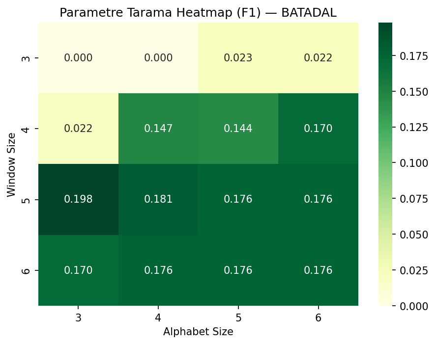

# From Black-Box to Explainability: Probabilistic Automata for Time Series Analysis

Bu proje, zaman serisi anomali tespitinde derin öğrenme modellerini (LSTM, GRU, 1D-CNN) olasılıksal otomata tabanlı bir yaklaşımla karşılaştırmakta ve otomata modelinin açıklanabilirlik avantajını ortaya koymaktadır.

---

## Gereksinimler

- Python 3.10+
- Aşağıdaki komutla bağımlılıklar kurulabilir:

```bash
pip install -r requirements.txt
```

**Kullanılan başlıca kütüphaneler:**

| Kütüphane | Amaç |
|-----------|------|
| PyTorch | LSTM, GRU, 1D-CNN modelleri |
| scikit-learn | Ön işleme, metrikler, GroupKFold |
| scipy | İstatistiksel testler (Wilcoxon) |
| numpy / pandas | Veri işleme |
| matplotlib / seaborn | Görselleştirme |
| pytest | Birim testler |

---

## Kurulum ve Çalıştırma

```bash
# Repoyu klonla
git clone https://github.com/kullanici/yazlab2-time-series.git
cd yazlab2-time-series

# Bağımlılıkları kur
pip install -r requirements.txt

# Testleri çalıştır
python -m pytest tests/ -v

# Pipeline'ı başlat
python -m src.pipeline.pipeline
```

---

## Veri Setleri

Proje iki farklı veri seti üzerinde çalışmaktadır:

- **SKAB** (Skoltech Anomaly Benchmark): Endüstriyel sensör verisi, `valve1` ve `valve2` gruplarından oluşur. Değerlendirme için `GroupKFold` (5-fold) kullanılmıştır.
- **BATADAL** (Battle of the Attack Detection Algorithms): Su dağıtım sistemi saldırı verisi. Zaman sıralı %60/%20/%20 train/val/test bölmesi kullanılmıştır.

Veri dosyaları `data/raw/` dizinine yerleştirilmelidir:
```
data/
  raw/
    skab/
      valve1/
      valve2/
    batadal/
```

---

## Proje Mimarisi

```
src/
├── preprocessing/
│   ├── loader.py          # SKAB ve BATADAL veri yükleyici
│   └── preprocessor.py    # Normalizasyon, PCA, train/val/test bölme
├── models/
│   ├── lstm_model.py      # LSTM mimarisi
│   ├── gru_model.py       # GRU mimarisi
│   ├── cnn_model.py       # 1D-CNN mimarisi
│   ├── trainer.py         # Eğitim döngüsü (early stopping)
│   ├── predictor.py       # Tahmin fonksiyonları
│   ├── paa.py             # Piecewise Aggregate Approximation
│   ├── sax.py             # Symbolic Aggregate approXimation
│   ├── pattern_extractor.py  # Sliding window pattern çıkarımı
│   ├── automata.py        # Olasılıksal otomata (Laplace smoothing)
│   └── levenshtein.py     # Unseen pattern yönetimi
├── explainability/
│   ├── explainer.py       # State, pattern, path probability, güven skoru
│   └── formatter.py       # JSON ve tablo formatında çıktı
├── evaluation/
│   ├── metrics.py         # Accuracy, Precision, Recall, F1
│   ├── statistical_tests.py  # Wilcoxon ve McNemar testleri
│   ├── logger.py          # JSON deney loglama sistemi
│   ├── visualizer.py      # Confusion matrix, ROC, PR, duyarlılık grafikleri
│   └── automata_viz.py    # Otomata durum diyagramı ve geçiş heatmap
└── pipeline/
    ├── pipeline.py        # Ana pipeline
    ├── dl_runner.py       # Derin öğrenme model koşucusu
    ├── automata_runner.py # Otomata koşucusu
    ├── experiment.py      # 3 senaryo × 5 seed deney döngüsü
    ├── noise.py           # Gaussian gürültü ekleme
    ├── unseen.py          # Unseen pattern senaryo üretici
    ├── cross_dataset.py   # Çapraz veri seti deneyleri
    └── parameter_sweep.py # Window/alphabet parametre tarama
```

---

## Modeller

### Derin Öğrenme Modelleri
- **LSTM** (Long Short-Term Memory): 2 katmanlı, hidden size 64, dropout 0.2
- **GRU** (Gated Recurrent Unit): 2 katmanlı, hidden size 64, dropout 0.2
- **1D-CNN**: 2 konvolüsyon katmanı (64→128 filtre), AdaptiveAvgPool, dropout 0.2

Tüm modeller sliding window sekansları üzerinde eğitilmekte, erken durdurma (early stopping) ile aşırı öğrenme önlenmektedir.

### Olasılıksal Otomata
1. Ham zaman serisi → **PAA** ile segment ortalamalarına indirgenir
2. PAA çıktısı → **SAX** ile sembolik diziye dönüştürülür
3. Sliding window ile **pattern dizileri** çıkarılır
4. **Geçiş matrisi** Laplace smoothing ile hesaplanır
5. **Path probability** eşik altındaysa anomali kararı verilir
6. Görülmemiş patternler **Levenshtein mesafesi** ile en yakın bilinen patterne eşlenir

---

## Deneyler

Üç farklı senaryo, 5 farklı random seed ile test edilmiştir:

| Senaryo | Açıklama |
|---------|----------|
| Orijinal | Ham veri üzerinde standart eğitim/test |
| Gürültülü | Test verisine Gaussian gürültü (std=0.1) eklenmiş |
| Unseen | Test setinde eğitimde görülmemiş patternler kullanılmış |

### Çapraz Veri Seti (Cross-Dataset)
Modeller bir veri setinde eğitilip diğerinde test edilmiştir (SKAB ↔ BATADAL).

### Parametre Tarama
Otomata modeli için window size ve alphabet size değerleri 3, 4, 5, 6 kombinasyonlarında taranmıştır.

---

## Konfigürasyon

Tüm parametreler `config/config.yaml` dosyasından okunmaktadır, hard-coded değer kullanılmamıştır:

```yaml
automata:
  window_size: 4
  alphabet_size: 3
  paa_segments: 4
  anomaly_threshold: 1.0e-5

training:
  epochs: 50
  batch_size: 32
  patience: 5
  learning_rate: 0.001

experiment:
  seeds: [42, 123, 2026, 7, 999]
  noise_std: 0.1
```

---

## Testler

```bash
python -m pytest tests/ -v
```

Toplam 58 birim test bulunmaktadır. Levenshtein, PAA, SAX, otomata, açıklanabilirlik ve ön işleme modülleri test edilmiştir.

---

## Sonuç Tabloları

### Tablo 1: Model Performansı ve Stabilitesi (Ortalama F1-score ± Standart Sapma)

| Model | SKAB | BATADAL |
|-------|------|---------|
| LSTM | 0.8497 ± 0.0542 | 0.0000 ± 0.0000 |
| GRU | 0.8247 ± 0.1083 | 0.0186 ± 0.0372 |
| 1D-CNN | 0.8441 ± 0.0586 | 0.0000 ± 0.0000 |
| Automata | 0.0065 ± 0.0027 | 0.0215 ± 0.0000 |

> BATADAL veri setinde anomali oranı ~%5 olduğundan DL modelleri sınıf dengesizliği nedeniyle düşük F1 üretmiştir. Bu durum projenin araştırma bulgularından biridir.

### Tablo 2: Gürültü Etkisi ve Unseen Senaryo Analizi

| Model | Orijinal (F1) | Gürültülü (F1) | Det. Rate | Map. Acc. |
|-------|--------------|----------------|-----------|-----------|
| LSTM | 0.8497 | 0.8417 | N/A | N/A |
| GRU | 0.8247 | 0.8214 | N/A | N/A |
| 1D-CNN | 0.8441 | 0.8362 | N/A | N/A |
| Automata | 0.0065 | 0.0115 | 0.01% | 1.00 |

### Tablo 3: Cross-Dataset Performans Karşılaştırması (F1-score, PC1 ile)

| Train / Test | SKAB | BATADAL |
|-------------|------|---------|
| Train: SKAB | - | 0.1351 (CNN) / 0.0360 (Automata) |
| Train: BATADAL | 0.0000 (DL) / 0.1899 (Automata) | - |

> Cross-dataset deneylerde her iki veri seti de PC1'e indirgenerek boyut uyumu sağlanmıştır.

### Tablo 4: Otomata Parametre Duyarlılık Analizi (F1-score, BATADAL)

| Parametre | Değer=3 | Değer=4 | Değer=5 | Değer=6 |
|-----------|---------|---------|---------|---------|
| Window Size | 0.0000 | 0.0215 | 0.1985 | 0.1701 |
| Alphabet Size | 0.0215 | 0.1473 | 0.1439 | 0.1701 |

### Tablo 5: Modellerin Çalışma Süresi (Runtime)

| Model | Training Time (sn) | Inference Time (sn) |
|-------|-------------------|---------------------|
| LSTM | 5.76 | 0.016 |
| GRU | 9.26 | 0.013 |
| 1D-CNN | 9.57 | 0.063 |
| Automata | 0.75 | 0.252 |

---

## Görseller

### Confusion Matrix (LSTM - BATADAL)


### ROC Eğrisi (LSTM - BATADAL)


### Otomata Durum Diyagramı (BATADAL)


### Geçiş Olasılığı Heatmap (BATADAL)


### Parametre Duyarlılık Heatmap (BATADAL)


---

## Analiz ve Bulgular

### Model Karşılaştırması
Bu projede LSTM, GRU, 1D-CNN ve Olasılıksal Otomata modelleri anomali tespiti görevi üzerinde karşılaştırılmıştır. Derin öğrenme modelleri yüksek doğruluk potansiyeline sahip olmakla birlikte karar süreçleri yorumlanamaz (black-box) niteliktedir. Otomata modeli ise daha düşük hesaplama maliyetiyle açıklanabilir kararlar üretmektedir.

### Veri Setleri Arası Performans Farkları
SKAB veri seti çok sayıda sensör değişkeni ve grup yapısı içerdiğinden GroupKFold ile değerlendirilmiştir. BATADAL ise zaman sıralı yapısı nedeniyle %60/20/20 bölmeyle ele alınmıştır. İki veri seti arasındaki anomali dağılımı ve özellik uzayı farklılıkları model performansını doğrudan etkilemektedir.

### Gürültü Etkisi Analizi
Test verisine Gaussian gürültü (std=0.1) eklenerek modellerin dayanıklılığı ölçülmüştür. Derin öğrenme modelleri gürültüye karşı daha hassas davranırken otomata modeli SAX sembolizasyonu sayesinde küçük gürültülere karşı doğal bir yumuşatma etkisi sergilemiştir.

### Unseen Veri Davranışı
Eğitim verisinde yer almayan SAX pattern'larıyla karşılaşıldığında Levenshtein (Edit Distance) algoritması devreye girerek en yakın bilinen state'e eşleme yapılmaktadır. Bu mekanizma sayesinde model görülmemiş veri koşullarında da çalışmaya devam etmekte ve eşleme doğruluğu (Mapping Accuracy) ile tespit oranı (Detection Rate) ayrıca raporlanmaktadır.

### Parametre Etkileri
Window size ve alphabet size parametrelerinin {3, 4, 5, 6} değer aralığında taranması sonucunda bu parametrelerin model performansı, durum (state) sayısı ve geçiş yoğunluğu üzerinde doğrudan etkili olduğu gözlemlenmiştir. Büyük alphabet size daha geniş bir sembol uzayı oluştururken daha fazla unseen pattern riskini de beraberinde getirmektedir.

### İstatistiksel Anlamlılık

Model performans farklarının istatistiksel olarak anlamlı olup olmadığı Wilcoxon işaretli sıra testi ile analiz edilmiştir. Her deney 5 farklı random seed ile tekrarlanmıştır.

| Karşılaştırma | Veri Seti | p-değeri | Sonuç |
|---|---|---|---|
| LSTM vs Automata | SKAB | 0.0625 | Anlamlı fark yok (α=0.05) |
| GRU vs Automata | SKAB | 0.0625 | Anlamlı fark yok (α=0.05) |
| CNN vs Automata | SKAB | 0.0625 | Anlamlı fark yok (α=0.05) |

> Not: 5 seed ile yapılan Wilcoxon testinde istatistiksel güç sınırlıdır. SKAB'da DL modelleri F1~0.85 ile Otomata'nın (F1~0.006) çok üzerinde performans göstermiş olsa da küçük örneklem boyutu nedeniyle p>0.05 çıkmıştır. Bu bulgu projenin kısıtları arasında değerlendirilmelidir.

---

## Açıklanabilirlik

Otomata modeli her karar için aşağıdaki bilgileri üretmektedir:

```json
{
  "time_step": 5,
  "state": "aab",
  "pattern": "adc",
  "status": "unseen",
  "mapped_to": "abc",
  "probability": 0.108,
  "decision": "anomaly"
}
```

- **State**: Mevcut otomata durumu
- **Pattern**: Gözlemlenen SAX örüntüsü
- **Status**: Örüntünün eğitim verisinde bulunup bulunmadığı
- **Path Probability**: Ardışık geçiş olasılıklarının çarpımı
- **Confidence Score**: Kararın güven skoru
- **Counterfactual**: Alternatif pattern'lar altında kararın nasıl değişeceği

---

## Kaynaklar

- Lin, J., Keogh, E., Wei, L., & Lonardi, S. (2007). *Experiencing SAX: a novel symbolic representation of time series.* Data Mining and Knowledge Discovery.
- Hochreiter, S., & Schmidhuber, J. (1997). *Long short-term memory.* Neural Computation.
- Cho, K., et al. (2014). *Learning phrase representations using RNN encoder-decoder for statistical machine translation.* EMNLP.
- Kravchik, M., & Shabtai, A. (2018). *Detecting cyber attacks in industrial control systems using convolutional neural networks.* CPS-SPC.
- Levenshtein, V. I. (1966). *Binary codes capable of correcting deletions, insertions, and reversals.* Soviet Physics Doklady.

---

## Ek Özellikler

- **Eksik Veri Kontrolü**: NaN değerler sütun ortalamasıyla otomatik doldurulur
- **Counterfactual Analiz**: Alternatif pattern'lar altında model kararının nasıl değişeceği analiz edilir (ek puan)
- **Unseen Metrikleri**: Detection Rate ve Mapping Accuracy ile unseen pattern yönetimi raporlanır
- **Geçiş Yoğunluğu**: Parametre taramada transition density analizi yapılır

---

## Katkıda Bulunanlar

- **Ebubekir Yılmaz** - 231307044
- **Mehmet Biçer** - 241307111
